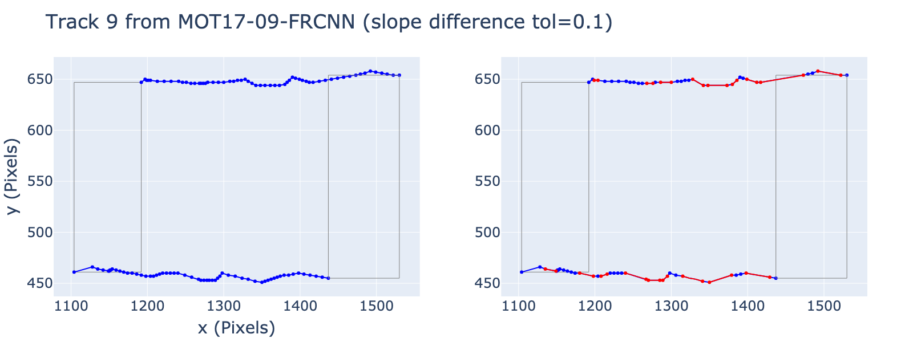

# Is MOT piecewise linear?

How linearly do people walk? This repo. analyses the MOT-17 and MOT-20 datasets to find out if people's motions are piecewise linear.



## Setup

Install the `motlinearity` helper package

```bash
pip install -r requirements.txt
pip install -e .
```

## Run the analysis

Download the MOT-17 data [https://motchallenge.net/data/MOT17/](https://motchallenge.net/data/MOT17/) (and possibly MOT20). The data should be located in `analysis/MOT17Labels/...`.

```bash
cd analysis
python analyze.py --mot MOT17 --command <XXX>
```

You can use `python analyze.py --help` for a more complete list of options, summarized here:

```
(1) plot-traj - Plot some trajectories from the dataset and their linear segments. 
(2) plot-traj-tog - Plot some trajectories from the dataset and their linear segments side-by-side. 
(3) lin-analysis - Run the linear analysis for the dataset. 
(4) random-walk-sim - simulate a random walk. 
(5) random-walk-analysis - Analyze the random walk. 
(6) plot-traj-tog-random-walk - Plot the trajectories and linear segments from the random walks.
```
